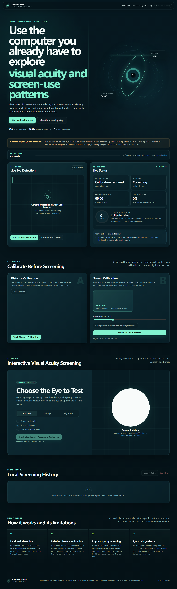

# VisionGuard AI

[**English**](README.md) | [简体中文](README.zh-CN.md) | [繁體中文](README.zh-TW.md) | [Repository home](../README.md)

VisionGuard AI is a browser-based visual-acuity screening and digital-eye-strain monitoring MVP. It uses the computer camera to run facial and eye-landmark inference locally, estimates relative viewing distance, counts blinks, reports heuristic fatigue indicators, and guides the user through a Landolt C gap-direction test.

> **Important notice:** This project is intended only for health screening and product demonstrations. It cannot diagnose myopia, astigmatism, eye disease, or any other medical condition, and it is not a substitute for an examination by an optometrist or ophthalmologist. Seek prompt professional medical evaluation for persistent blurred vision, eye pain, double vision, flashes of light, a sudden increase in floaters, or visual-field abnormalities.



## Implemented Features

- A visible six-stage journey: **Access → Consent → Calibrate → Screen → Explain → Guide**, with progress and elapsed-time feedback on one responsive page.
- A required, revocable camera-consent step that explains purpose and processing before the browser asks for camera access. Optional consent separately controls persistence of derived results.
- Browser camera permission handling, startup, pause/resume, shutdown, exit, and recovery messages. A manual fallback keeps the acuity test usable when camera monitoring is unavailable.
- Local inference with MediaPipe Face Landmarker; the model and WASM files are bundled with the project. Raw camera frames are not saved or uploaded.
- Periocular measurements from 478 facial landmarks, real-time lighting checks, calibration at a known distance of 60 cm, and viewing-distance guidance across the required **40–80 cm** range.
- Automatic response pausing when the face is lost, the head is misaligned, or live camera conditions are unsuitable.
- An optional continuous-monitoring mode with explicit start, pause, resume, stop, and exit controls; visible status and active duration; and 20-minute or stop/interruption summaries. Ordinary browsers interrupt when hidden; a trusted Electron preload bridge can explicitly allow minimized/hidden-window monitoring.
- Adaptive eye-aspect-ratio thresholds, blink counting, blinks-per-minute measurement, and a heuristic fatigue score based on blink rate, distance behavior, and uninterrupted screen time.
- A session-only symptom questionnaire covering visual discomfort and warning signs; symptom answers are not written to browser storage.
- Physical screen-size calibration using either an ISO/IEC 7810 ID-1 reference (85.60 × 53.98 mm)—a bank, identity, or student card only when it actually conforms to that standard—or an ICAO TD-3 machine-readable passport reference (125 × 88 mm). A clearly marked, lower-confidence screen-diagonal estimate is available when no reference object is at hand.
- Interactive Landolt C screening with 9 levels from 20/200 to 20/20, 3 trials per level, and at least 2 correct responses required to advance.
- Binocular, left-eye, and right-eye modes; responses work with the mouse, arrow keys, or WASD.
- A three-band interpretation (**Normal / Caution / Concern**) that escalates when multiple indicators agree.
- Every completed screening is explained in exactly four numbered parts: result, main indicators, confidence and limitations, and next step.
- One-screen result cards for acuity, blink rate, and viewing distance, together with the non-diagnostic disclaimer and matched professional-care guidance.
- Optional local history, same-eye trends, JSON export, printable/shareable summary, and a local 20-minute retest/break reminder. Each result uses an immutable completion snapshot; persisted summaries omit symptoms and per-question answers. Demo results are excluded from trends.
- A configurable campus-access card with a locally generated QR code, copyable link, print support, and professional-referral path. It requires no booking system, special equipment, or staffed workflow.
- A camera-free demo mode for validating the product flow. Simulated results are clearly marked and are not presented as medical evidence.
- Selectable **Simplified Chinese, Traditional Chinese, and English**. On first use, the app follows the device/browser's primary language when it is one of those language families (`zh-Hans` and most generic Chinese locales map to Simplified Chinese; `zh-Hant`, Taiwan, Hong Kong, and Macao locales map to Traditional Chinese). English is used when detection is unavailable or the device language is unsupported. A user's explicit selection is remembered locally and takes priority on later visits.
- Responsive desktop and mobile interfaces, including safe-area-aware phone layouts, a portrait camera stage, touch-sized controls, and a compact landscape test layout; no account or application server is required.

## Technology Stack

- React 18
- TypeScript 5
- Vite 5
- Electron 43 (optional Windows/macOS tray shell)
- MediaPipe Tasks Vision 0.10.35
- QRCode 1.5.4
- Vitest

The application uses a purely front-end architecture. Camera frames are sent directly to MediaPipe inference in the browser and are never uploaded to the project server. The code retains a static-resource CDN fallback for cases where the local model or WASM files are missing; that fallback only downloads the model/runtime and never uploads footage. The release package already includes the required model and WASM files, so normal local operation does not depend on this fallback.

## Local Development

### Requirements

- Node.js 18.18 or later
- npm
- A computer with a camera; demo/manual operation is available without one
- A current Chrome/Edge desktop browser, Chrome on Android, or Safari on iOS is recommended

### Startup

```bash
cd visionguard-ai
npm install
npm run dev
```

Open the address shown in the terminal, normally:

```text
http://127.0.0.1:5173
```

Use `http://127.0.0.1` or `http://localhost`. Do not open `index.html` directly because browser security policies may block camera access or ES-module loading.

After `npm install`, the asset-preparation script:

- Copies WASM files from MediaPipe to `public/mediapipe/wasm/`;
- Checks for `public/models/face_landmarker.task` and attempts to download the official model only when it is missing.

This delivery already includes both asset types.

## Production Build and Run

Build and preview with Vite:

```bash
npm run build
npm run preview
```

The default preview address is `http://127.0.0.1:4173`.

The delivery also includes a prebuilt `dist/` directory. To run it without installing Node.js:

```bash
python serve_dist.py
```

The local server prefers **Google Chrome** on both Windows and macOS. It checks `CHROME_PATH`, standard Chrome installation folders, and commands available on `PATH`; if Chrome is unavailable or cannot start, it safely falls back to the operating system's default browser. The server itself continues running regardless of which browser opens.

The command is resolved relative to the terminal's **current directory**, not the file currently open in the editor. From the project directory, use the command above. From the parent `assignment5` workspace, either use the included forwarding launcher with the same command or call the project script explicitly:

```powershell
python .\serve_dist.py
# equivalent explicit path from assignment5:
python .\visionguard-ai\serve_dist.py
```

If Python reports that it cannot open `...\assignment5\serve_dist.py`, the terminal is in the parent directory and that launcher is missing from the copy being used; `cd .\visionguard-ai` first or use the explicit project path. IDE **Ctrl+F5** works in that situation because the editor launches the active file by its full path rather than resolving only `serve_dist.py` from the terminal directory.

To choose another port:

```bash
python serve_dist.py --port 8088
```

Browser-opening options are forwarded by both the project script and the parent-workspace launcher:

```bash
# Explicitly keep the Chrome-first strategy (also the default)
python serve_dist.py --browser chrome

# Skip Chrome discovery and use the system default browser
python serve_dist.py --browser default

# Start only the server and do not open any browser
python serve_dist.py --no-browser

# Show all host, port, and browser options
python serve_dist.py --help
```

`--browser` and `--no-browser` are mutually exclusive. If Chrome uses a non-standard installation location, set `CHROME_PATH` to its full executable path before running the command.

Alternatively, serve `dist/` with any static HTTP server. Do not open `dist/index.html` through `file://`.

### Optional Windows/macOS desktop shell

An Electron tray shell is included for consented continuous monitoring while the window is minimized or hidden. It loads only the bundled local `dist/`, keeps the renderer unthrottled, and prevents application suspension only while monitoring is active. Closing the window hides it; the user must explicitly quit from the tray or macOS application menu to end the process.

```bash
npm install
npm run desktop
```

See [DESKTOP.md](DESKTOP.md) for the security boundary, camera permission behavior, packaging commands, signing requirements, and limits of background operation.

### Mobile use

The camera request prefers the front-facing camera and the interface has separate narrow portrait and short landscape layouts. A phone must open the app from an HTTPS deployment (or its own `localhost` during development); another computer's `127.0.0.1` address is not reachable from the phone. For physical card/passport calibration, rotate a narrow phone to landscape if the complete outline cannot fit, or use the clearly marked screen-diagonal estimate. Real-device camera performance and physical accuracy must still be acceptance-tested on each supported phone/browser combination.

### Campus deployment configuration

Institution-specific values can be added to the published URL, so a coordinator can prepare a campus QR/link without rebuilding the app:

| Query parameter | Purpose | Limit |
|---|---|---|
| `campus` | Campus or support-unit name | 80 characters |
| `campaign` | Campaign title | 120 characters |
| `code` | Optional access code printed on the card | 32 characters |
| `referral` | Approved `https:`, `http:`, or `mailto:` referral destination | 2,048 characters |

Example:

```text
https://screening.example.edu/?campus=North%20Campus&campaign=Healthy%20Eyes%20Week&code=EYE-2026&referral=https%3A%2F%2Fhealth.example.edu%2Feye-care
```

Invalid, over-length, relative, credential-bearing, or unsafe referral values are ignored and the localized in-app defaults remain in use. URL parameters configure public campaign information only; they never contain or transmit screening results.

See [DEPLOYMENT_QR.md](DEPLOYMENT_QR.md) for the recommended HTTPS static-hosting route, temporary tunnel and campus-intranet alternatives, PWA/native upgrade paths, and the reason a localhost QR code cannot be opened from a different phone.

## Testing and Quality Checks

```bash
npm run typecheck
npm run test
npm run build
python -m unittest discover -s tests -p "test_*.py"
```

The current 114 unit tests across 14 test files cover:

- Geometric statistics and numeric boundaries;
- Eye-aspect ratio and distance estimation;
- Physical optotype size and conversion among Snellen, decimal visual acuity, and logMAR;
- Blink rate, fatigue score, and recommendation generation;
- Multi-signal risk classification and its explanation fields;
- Immutable result snapshots, legacy-history migration, and minimal persistence;
- Continuous-monitoring window calculations, short-sample handling, report allowlisting, and live-camera-only report validation;
- Electron desktop-runtime bridge validation and monitoring-active lifecycle notifications;
- Safe, no-build campus campaign and referral URL configuration;
- Local reminder scheduling and same-eye trend calculations;
- Device-locale mapping, saved-choice precedence, translations, and message coverage.

Browser automation validated locale-aware startup, consent gating, demo startup, screen calibration, manual fallback, language switching without losing the active test, four explanation blocks, three indicator cards, risk output, trend rendering, local QR generation, and no horizontal overflow at 390 px. No application console errors were observed. The local Face Landmarker model and WASM files also passed a separate initialization smoke test.

See [REQUIREMENTS_AUDIT.md](REQUIREMENTS_AUDIT.md) for the PPT-by-PPT requirement matrix and [VALIDATION.md](VALIDATION.md) for detailed evidence and the distinction between software verification and outstanding participant/device accuracy validation.

## Usage

1. Open the page directly or from its campus QR/link. On first use, the interface follows a supported device/browser language and otherwise starts in English; use the always-visible header selector to switch among Simplified Chinese, Traditional Chinese, and English.
2. Read the privacy explanation and grant camera consent. Result-history storage is a separate optional choice and can be revoked.
3. Start camera detection and allow browser access, or choose the camera-free demo/manual route.
4. Keep your face in frame, correct the lighting if prompted, position your eyes at approximately 60 cm, and perform distance calibration. During monitoring, stay within 40–80 cm.
5. Choose a screen-size calibration method. Match the on-screen outline to a conforming ISO/IEC 7810 ID-1 bank/identity/student card or an ICAO TD-3 passport, then save. If no reference object is available, enter the current display's diagonal size and save the result as an approximate calibration.
6. Select applicable symptoms, then choose binocular, left-eye, or right-eye screening. During a monocular test, lightly cover the other eye without pressing on it.
7. Identify the Landolt C gap direction. Pause, stop, or exit at any time. If monitoring cannot continue, use manual fallback to finish the acuity responses.
8. Review the risk band and four-part explanation. You may print/copy a shareable summary, inspect same-eye trends, set the local 20-minute reminder, export opted-in history, or follow professional/campus referral guidance.

Demo results are visibly marked as simulated data.

### Optional continuous monitoring

After camera consent, choose **Start continuous monitoring** in the dedicated panel. In a normal browser this is a foreground-only feature, not an operating-system background service: it counts time only while the page is open and visible and the live camera stream is active. Pause disables camera capture; stop or exit ends the current monitoring window and creates a structured summary. A completed 20-minute window creates the same kind of summary automatically.

An Electron desktop shell may expose the narrow preload contract `window.desktopRuntime = { isDesktop: true, platform, setMonitoringActive(boolean) }`. Only when that trusted bridge is present may monitoring continue while its window is minimized or hidden; clicking the desktop window's close button hides it to the tray and does not interrupt monitoring. The renderer still requires an active media stream, and the bridge is notified only while continuous monitoring is truly active. Explicitly quitting the app, reloading or navigating the renderer, freezing, a long execution gap, or stream loss interrupts the window. Ordinary browsers remain hidden-page interrupt-only and never infer desktop capability from a user-agent string. Raw frames are never included in reports, and reports remain only in page memory unless optional local-storage consent is enabled.

## Core Calculations

### Relative Distance

At the 60 cm reference position, the outer-eye-corner span is divided by the intrinsic camera-frame width to form the resolution-independent ratio `R_ref`. For a later ratio `R_now`:

```text
D_now = D_ref × R_ref / R_now
```

The app publishes this estimate only while face pose and lighting are acceptable and smooths the latest valid samples with a rolling median. A change in camera-frame orientation or aspect ratio invalidates the baseline and requires recalibration. The estimate still assumes that focal length, digital zoom, crop, and facial conditions remain stable; it is not a substitute for a depth camera or calibrated distance device.

### Blinks

The application calculates eye aspect ratio (EAR) from six landmarks for each eye. It establishes an individual open-eye baseline and uses a proportion of that baseline as the closure threshold. A closure-and-reopening sequence counts as a blink only when its duration falls within a reasonable range.

### Fatigue Score

The fatigue score is a heuristic behavioral indicator from 0 to 100. Its inputs include:

- Blink rate below the target;
- Proportion of monitored time spent outside the intended distance behavior;
- Duration of continuous monitoring.

It has no clinical diagnostic meaning. Monitoring initially displays a collecting-data state to avoid conclusions from extremely short samples.

### Optotype Size

Physical-reference calibration determines CSS pixels per millimeter from either an ISO/IEC 7810 ID-1 outline (85.60 × 53.98 mm) or an ICAO TD-3 machine-readable passport outline (125 × 88 mm). Identity and student cards vary across countries and issuers, so the card option must be used only with an item known to conform to ID-1. The Landolt C height uses the 5-arcminute visual angle for the target Snellen level and is converted to screen pixels.

The no-object option requires the user to enter the physical diagonal of the current device and combines it with `window.screen.width` and `window.screen.height` to estimate logical screen pixels per millimeter. No laptop-sized value is prefilled on a phone. Swapping portrait and landscape axes does not change the diagonal calculation, but system/interface scaling, moving between displays, and an incorrect device specification can affect the result.

A browser cannot reliably auto-detect physical display dimensions. Standard web APIs expose CSS-pixel dimensions, but not a trustworthy physical panel width/height or monitor EDID. Likewise, ordinary `getUserMedia()` camera metadata does not provide the calibrated sensor size, focal length, and scene scale needed to recover absolute dimensions from a single monocular image. Camera resolution or `devicePixelRatio` alone is therefore not a valid substitute for calibration. A native application with permission to read display hardware metadata, a depth/AR API, or a known object in view could offer stronger device-specific calibration, but this browser MVP does not claim that precision.

Recalibrate after changing the display, browser zoom, screen scaling, or display orientation/setup.

## Native application packages

- Windows: `npm run desktop:dist:win` creates the NSIS installer.
- Android: `npm run android:apk` creates a debug-signed, directly installable
  APK after JDK 21 and Android SDK 36 are installed.
- Linux: `npm run desktop:dist:linux` creates AppImage and deb packages.
- macOS: `npm run desktop:dist:mac` creates separate Intel and Apple Silicon
  DMGs on macOS.

See [ANDROID.md](ANDROID.md) for Android permissions, signing, and device tests,
and [DESKTOP.md](DESKTOP.md) for desktop runtime, signing, and packaging details.
The repository-level `Package applications` GitHub Actions workflow can build
unsigned/test artifacts on each native host when manually dispatched or when a
`v*` tag is pushed.

## Project Structure

```text
visionguard-ai/
├── android/                     # Capacitor Android project and Gradle wrapper
├── electron/                    # Secure Electron main/preload, tray asset
├── public/
│   ├── mediapipe/wasm/          # Local MediaPipe WASM
│   └── models/face_landmarker.task
├── scripts/prepare-assets.mjs   # Post-install asset preparation
├── src/
│   ├── components/              # Camera, consent, calibration, continuous monitoring, screening, results
│   ├── hooks/useVisionEngine.ts # Camera and real-time inference flow
│   ├── i18n/                    # zh-CN, zh-TW, and English messages/provider
│   ├── lib/                     # Acuity, fatigue, risk, reminders, trends, storage, and tests
│   ├── App.tsx
│   ├── app.css
│   ├── mobile.css               # Portrait, landscape, touch, and safe-area refinements
│   └── language-typography.css  # English-specific spacing and wrapping
├── dist/                        # Validated production build
├── serve_dist.py                # Dependency-free local static server
├── ANDROID.md                   # Android APK, signing, and device-test guide
├── DESKTOP.md                   # Windows/Linux/macOS packaging guide
├── DEPLOYMENT_QR.md             # HTTPS hosting and scan-to-use paths
├── VALIDATION.md                # Delivery validation record
├── THIRD_PARTY_NOTICES.md
├── README.zh-CN.md              # Simplified Chinese documentation
├── README.zh-TW.md              # Traditional Chinese documentation
└── README.md
```

## Privacy and Data

- Camera footage is neither stored nor sent to an application server.
- Camera access is requested only after explicit purpose-and-processing consent and can be paused or stopped in the interface.
- Face landmarks and derived indicators are processed locally. Raw images and video are never written to local history.
- Symptom answers are session-only and are not persisted.
- Only when the user selects optional storage consent are derived screening results and reminder settings stored in the current browser's `localStorage`. Display calibration and language are local settings, not raw health media.
- Continuous-monitoring reports contain only timestamps, active/tracked duration, tracking coverage, blink rate, distance, too-close ratio, fatigue indicators, and semantic recommendation codes. They are persisted only under the same optional storage consent.
- The interface includes a local-data deletion control; clearing browser site data also deletes local records.
- JSON export occurs only when the user requests it and is saved only to the location the user chooses.
- The code includes no login, remote database, analytics tracking, or advertising SDK.

## Known Limitations

- A monocular webcam provides only a calibrated relative-distance estimate. Posture, lens field of view, autofocus, and digital zoom affect it.
- Glasses reflections, occlusion, low light, strong backlighting, camera resolution, and rapid head movement reduce landmark stability.
- Physical screen-size calibration depends on correct reference selection and positioning; not every identity or student card conforms to ID-1. The diagonal-only method is an approximation and may be inaccurate under browser/OS scaling or multi-display setups. Both methods require recalibration after relevant display or zoom changes.
- Home screen-based acuity screening is affected by environment, eye-covering technique, learning effects, and display quality. It can only indicate that further examination may be warranted.
- The fatigue score and risk band are transparent rule-based screening aids, not diagnostic models or validated medical devices.
- Continuous monitoring cannot run after its browser page closes or the desktop renderer/application explicitly exits. In the Electron shell, the window close button only hides to the tray and monitoring may continue; a renderer reload/navigation or explicit application quit interrupts it. Ordinary browsers interrupt when hidden. Browser or renderer freezing, timer throttling, device sleep, camera disconnection, and operating-system power policies can still interrupt a window; this is not system-level monitoring.
- The assignment's numerical accuracy targets—visual acuity within one chart line, blink detection F1 above 0.85, and distance error within 5 cm across 40–80 cm—have **not** yet been established by real-participant and calibrated-reference testing. Passing unit and browser tests does not establish these claims.
- The campus URL and referral content are configurable placeholders. A real deployment must insert institution-approved pages, clinic contacts, escalation wording, and privacy policy.

## License

The project's original code is licensed under the MIT License; see [LICENSE](LICENSE). Notices for MediaPipe, QRCode, the model, and other third-party components are provided in [THIRD_PARTY_NOTICES.md](THIRD_PARTY_NOTICES.md) and `licenses/`.
